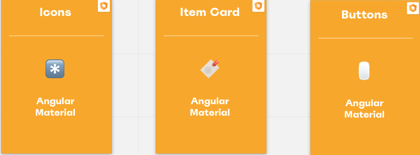
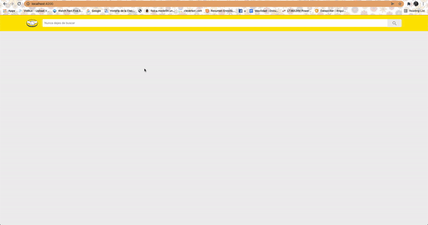
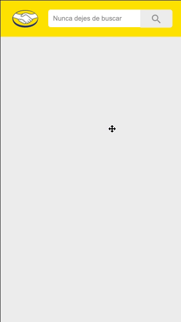

# Desafío MeLi 👩🏽‍💻

El desafío era desarollar una aplicacioón con tres componentes:

- Caja de búsqueda
- Resultados de búsquedas
- Detalle del producto

Cada una de las vistas mencionadas anteriormente debían ser navegables y dos de ellas (resultados de bùsqueda y detalle del producto) debían enviar peticiones al server para consultar la API de mercado libre con el fin de mostrar los resultados correspondientes.

## Acercamiento al Desafío 🛬
El primer paso fue conocer un poco mas el desafío. Para ello inicialmente hice un mapeo de los componentes gráficos lo cual consitió "desmenuzar" los diseños en componentes que pudiesen ser reusables. El resultado del <strong>mapeo de componentes gráficos</strong> fue el siguiente:

La siguiente etapa fue identificar los <strong> servicios y rutas</strong> tanto del cliente como del servidor.

### Servicios del Cliente

Los servicios del cliente se separaron por funcionalidad. Estos fueron los identificados:

### Servicios y Rutas del Server
Los servicios del server se separaron por responsabilidad. Estos fueron los identificados:

Después de esto planteé la estructura del proyecto (que cambioó en el proceso de desarrollo). A grandes rasgos el proyecto se divide en dos sub-proyectos `meli-items-finder`, que sería el proyecto del cliente y `meli-server`, el proyecto del servidor. Esta es la última actualizacioón de la estructura del proyecto: 

La siguiente tabla explica los diferentes recursos del cliente:

|Nombre del Recurso          |Naturaleza |Explicación                                                                                                                     |
|----------------------------|-----------|--------------------------------------------------------------------------------------------------------------------------------|
|[ItemsModule](meli-items-finder/src/app/items/items.module.ts)                 |Module     |Módulo de funcionalidad de items. Contiene los componentes y servicios relacionados y solamente relacionados con los items      |
|[ItemsRoutingModule](meli-items-finder/src/app/items/items-routing.module.ts)          |Module     |Módulo de ruteo de items. Se encarga de cargar los componentes necesarions para las diferentes ruas de la funcionalidad de items|
|[ItemResultComponent](meli-items-finder/src/app/items/components/item-results)         |Component  |Sección principal de los resultados de la búsqueda de items                                                                     |
|[ItemDescriptionComponent](meli-items-finder/src/app/items/components/item-description)    |Component  |Sección principal de la descripción extendida de un item                                                                        |
|[ItemCardComponent](meli-items-finder/src/app/items/components/item-card)           |Component  |Información del item en forma de card                                                                                           |
|[ItemPurchaseInfoComponent](meli-items-finder/src/app/items/components/item-purchase-info)   |Component  |Caja de información de purchase del item                                                                                        |
|[ItemExtInfoComponent](meli-items-finder/src/app/items/components/item-ext-info)        |Component  |Caja de información extendida del item                                                                                          |
|[Preloader Service](meli-items-finder/src/app/core/services/preloader)           |Service    |Contiene todos los métodos y las propiedades relacionados con el preloader del aplicativo                                       |
|[HttpService](meli-items-finder/src/app/core/services/http)                 |Service    |Contiene los métodos necesarios para realizar peticiones http                                                                   |
|[BreadcrumbService](meli-items-finder/src/app/core/services/breadcrumbs)           |Service    |Contiene todos los métodos y propiedades relacionados para el manejo de los breadcrumbs del aplicativo                          |
|[ItemsService](meli-items-finder/src/app/core/services/items)                |Service    |Contiene todos los métodos y propiedades relacionados con el manejo de los items                                                |
|[HttpInterceptor](meli-items-finder/src/app/core/services/http)             |Interceptor|Servicio que intercepta todas las peticiones http del cliente para hacer manejo de errores y skeletons                          |
|[BreadcrumbComponent](meli-items-finder/src/app/shared/components/breadcrumb)         |Component  |Navegación tipo breadcrumb de la aplicación                                                                                     |
|[PageNotFoundComponent](meli-items-finder/src/app/shared/components/page-not-found)       |Component  |Página de not found en caso de que alguna petición no haya encontrado resultados                                                |
|[RectangularSkeletonComponent](meli-items-finder/src/app/shared/components/rectangular-skeleton)|Component  |Skeletons utilizados para dar loa sensación de carga mientras la petición http se resuelve                                      |
|[SearchBarComponent](meli-items-finder/src/app/shared/components/search-bar)          |Component  |Componente de búsqueda del aplicativo                                                                                           |
|[Meli Theme](meli-items-finder/src/meli-theme.scss)                  |Style      |Paleta de colores y tipografía de MeLi                                                                                          |
|[BreadcrumbModel](meli-items-finder/src/app/core/models/breadcrumb.model.ts)             |Interface  |Interfaz de breadcrumbs                                                                                                         |
|[CustomErrorModel](meli-items-finder/src/app/core/models/customError.model.ts)            |Interface  |Interfaz de error model para el manejo de errores                                                                               |
|[ItemSummaryModel](meli-items-finder/src/app/core/models/item-summary.model.ts)            |Interface  |Interfaz de item                                                                                                                |
|[SignatureModel](meli-items-finder/src/app/core/models/signature.model.ts)              |Interface  |Interfaz de firma del autor                                                                                                     |
|[ItemResultModel](meli-items-finder/src/app/core/models/item-result.model.ts)             |Interface  |Interfaz de resultado de busqueda de items por string                                                                           |
|[RequestModel](meli-items-finder/src/app/core/models/request.model.ts)                |Interface  |Interfaz de peticiones http                                                                                                     |
|[Function Utils](meli-items-finder/src/app/utils/functions.utils.ts)              |Utilities  |Funciones de utilidad                                                                                                           |

La siguiente tabla explica los diferentes recursos del servidor:

|Nombre del Recurso|Naturaleza   |Explicación                                                                                                            |
|------------------|-------------|-----------------------------------------------------------------------------------------------------------------------|
|[ItemsRouter](meli-server/routes/items.js)       |Router       |Router de las peticiones asociadas con los items                                                                       |
|[MeliService](meli-server/services/meli/meli.js)       |Class/Service|Clase que contiene todos los metodos y propiedades para comunicarse y manejar la información obtenida de la API de MeLi|
|[CustomError](meli-server/utils/customError.js)       |Class/Model  |Clase que extiende la clase Error con el fin de agregar el status code para el manejo de errores                       |
|[FetchWrapper](meli-server/services/http/fetchWrapper.js)      |Class/Service|Clase que contiene los métodos y propiedades para realizar los llamados htttp                                          |
|[Function Utils](meli-server/utils/function-utils.js)    |Utilities    |Funciones de utilidad   

### Heramientas
Las herramientas utilizadas para el desarrollo de este proyecto fueron las siguientes

#### Cliente
Las herramientas del cliente fueron elegidas para la fácilidad de desarrollo ya que son en las cuales tengo experiencia y además cuentan con diversas librerías que permitían el desarrollo rápido y fácil del aplicativo.

- Angular
- Angular Material
- TypeScript
- HTML5
- Saas
- RxJs

- [Framework](https://material.angular.io/guide/theming)
- [Theming](https://material.angular.io/guide/theming)
- [Search Bar](https://material.angular.io/components/input/overview)
- [Buttons](https://material.angular.io/components/button/overview)
- [Icons](https://material.angular.io/components/icon/overview)
- [Item Card](https://material.angular.io/components/card/overview)

#### Server
Las herramientas del server fueron elegida debido a recomendaciones de la prueba. 

- NodeJs
- ExpressJs
- RxJs

Para una mejor visualizacioóm de todo el proceso de ideación 💡 accede a este [Miro Board](https://miro.com/app/board/uXjVO3MZnyI=/?share_link_id=812004862892). 

# A Desarrollar 🙌🏽

Para el desarrollo se tuvo en cuenta que el coódigo fuese lo más reusable, usable, escalable y performante posible. Estás fueron algunas consideraciones que ayudaron a este propósito:

- Cada uno de los componentes gráficos está dividido/agrupado por funcionalidad.
- Se tuvo en cuenta el lazy module loading tratando de usar los recuersos necesarios en el momento necesario.
- Para varios servicios compratidos se utilizó programación reactiva con RxJs garantizando la comunicación entre componentes de manera asíncrona, garantizando tener el último valor emitido.
- Las funciones se trataron de hacer lo más sencillas posibles para no tener side effects
- Se empleó el accesibility para algunos elementos (Para probar esto activa el plugin el screen reader de tu navegador, también puedes navegar con el teclado)
- Se adicionaron elementos gráficos para hacer la experiencia más "smooth" (skeletons, not found page y long text vanish)

Para más detalles del código dirígete a los archivos pertinentes 😁

## Correr `meli-items-finder`

Después de clonar el repositorio ejecuta `ng serve` en tu terminal para tener tu entorno local de cliente (recuerda correrlo en folder del proyecto de angular 😅). Abre `http://localhost:4200/` en tu navegador ¡El cliente de MeLi debería estar corriendo!

## Correr `meli-server`
Después de clonar el repositorio ejecuta `npm start app.js` en tu terminal para tener tu entorno local de servidor (recuerda correrlo en folder del server 😅) ¡El server de MeLi debería estar corriendo y con ello deberiía estar funcionando el cliente!

## Desktop Performance
This is how the UI should behave on desktop

## Mobile Performance
This is how the UI should behave on mobile

# Algunas Notas `<aside></aside>`
En esta seccioón encontrarás algunas mejoras que se hicieron en cuanto a experiencia y diseño y algunos pendientes (Si algun item está marcado con ✅ significa que está resuelto)

## Mejoras ✨
- Skeletons ✅
- Not found place holder ✅
- Image placeholder ✅
- "See more" fade  en la descripción del item ✅
- Accesibility ✅

## Pendientes ❗️
- Resize de imagen del buscador ✅
- Remover linea del input del search bar ✅
- Search icon color ✅
- Empty route background color ✅
- Breadcrumb links y descripciones ✅
- Agregar evento de enter al search bar  ✅
- Error handling ✅
- Mejorar codigo de server ✅