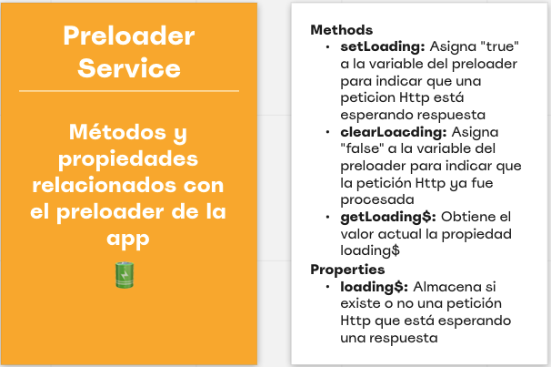

# Desafío MeLi 👩🏽‍💻

El desafío era desarollar una aplicacioón con tres componentes:

- Caja de búsqueda
- Resultados de búsquedas
- Detalle del producto

Cada una de las vistas mencionadas anteriormente debían ser navegables y dos de ellas (resultados de bùsqueda y detalle del producto) debían enviar peticiones al server para consultar la API de mercado libre con el fin de mostrar los resultados correspondientes.

## Challenge Approach 🛬
El primer paso fue conocer un poco mas el desafío. Para ello inicialmente hice un mapeo de los componentes gráficos lo cual consitió "desmenuzar" los diseños en componentes que pudiesen ser reusables. El resultado del <strong>mapeo de componentes gráficos</strong> fue el siguiente:

La siguiente etapa fue identificar los <strong> servicios y rutas</strong> tanto del cliente como del servidor.

### Servicios del Cliente

Los servicios del cliente se separaron por funcionalidad. Estos fueron los identificados:

### Servicios y Rutas del Server
Los servicios del server se separaron por responsabilidad. Estos fueron los identificados:

Después de esto planteé la estructura del proyecto (que cambioó en el proceso de desarrollo). A grandes rasgos el proyecto se divide en dos sub-proyectos `meli-items-finder`, que sería el proyecto del cliente y `meli-server`, el proyecto del servidor. Esta es la última actualizacioón de la estructura del proyecto: 

<iframe width="768" height="432" src="https://miro.com/app/live-embed/uXjVO3MZnyI=/?moveToViewport=-32197,19150,43154,21240" frameBorder="0" scrolling="no" allowFullScreen></iframe>

The fllowing is a table that contains the main resources summary:
|Resource Name            |Nature   |Explanation                                                                                                                |
|-------------------------|---------|---------------------------------------------------------------------------------------------------------------------------|
|[ContractsModule](src/app/contracts/contracts.module.ts)          |Module   |Contractors module block of functionality. It contains components and services related to only contractors functionalities.|
|[ContractsComponent](src/app/contracts/components/contracts/contracts.component.ts)      |Component|Main section of contractors view                                                                                           |
|[ContractsToolsComponent](src/app/contracts/components/contracts-tools/contracts-tools.component.ts)  |Component|Set of components that helps excecuting actions within contracts view (filtering adn adding)                               |
|[CotractCardComponent](src/app/contracts/components/contract-card/contract-card.component.ts)     |Component|Contractor info as a card item (mobile)                                                                                    |
|[ContractsTableComponent](src/app/contracts/components/contracts-table/contracts-table.component.ts)  |Component|Contractors info (desktop)                                                                                                 |
|[StatusBadgeComponent](src/app/contracts/components/status-badge/status-badge.component.ts)     |Component|Item that indicates the state of a contractor                                                                              |
|[ContractsActionsComponent](src/app/contracts/components/contracts-actions/contracts-actions.component.ts)|Component|Menu to perform action for a specific contractor (sign, delete, edit, view summary)                                        |
|[NavigationComponent](src/app/navigation/components/nav/nav.component.ts)      |Component|Main navigation bar                                                                                                        |
|[FloatingButtonComponent](src/app/shared/floating-button/floating-button.component.ts)  |Component|A rounded floatting button                                                                                                 |
|[DateRangePickerComponent](src/app/shared/date-range-picker/date-range-picker.component.ts) |Component|Input that lets the user to select a date range                                                                            |
|[SelectComponent](src/app/shared/select-input/select-input.component.ts)          |Component|Input that allows the user to select items within a list                                                                   |
|[ContractorsService](src/app/core/services/contractors/contractors.service.ts)       |Service  |Contains all the methods and properties related to contractors info                                                        |
|[ResponsiveService](src/app/core/services/responsive/responsive.service.ts)        |Service  |Contains all the methods and properties related to responsivness                                                           |
|[SupportService](src/app/core/services/support/support.service.ts)           |Service  |Contains all the methods and properties related to support team                                                            |
|[on-top-themes](src/on-top-themes.scss)            |Style    |Color palette and typography settings                                                                                      |
|[ContractorModel](src/app/core/models/contractor.model.ts)          |Model    |Contractor interface                                                                                                       |
|[ContractorFilterModel](src/app/core/models/contractors-filter.model.ts)    |Model    |Contractors' filter interface                                                                                              |
|[DateRangeModel](src/app/core/models/date-range.model.ts)           |Model    |Date range interface                                                                                                       |
|[NavItemModel](src/app/core/models/nav-item.model.ts)             |Model    |Navigation item interface                                                                                                  |

Doing an analysis of the components and the requirements I decided to use a set of Angular Material components and functionalities:

This is a summary of the used tools:
- [Theming](https://material.angular.io/guide/theming)
- [Contracts Filter - Date Range](https://material.angular.io/components/datepicker/overview)
- [Contracts Filter - Type, Status](https://material.angular.io/components/select/overview)
- [Contracts Filter - Name](https://material.angular.io/components/input/overview)
- [Search Bar](https://material.angular.io/components/input/overview)
- [Tools Buttons - Filters, New Hire](https://material.angular.io/components/button/overview)
- [Contracts Actions](https://material.angular.io/components/menu/overview)
- [Support Button](https://material.angular.io/components/button/overview)
- [Icons](https://material.angular.io/components/icon/overview)
- [Nav Bar - Desktop](https://material.angular.io/components/list/overview)
- [Nav Bar - Mobile](https://material.angular.io/components/expansion/overview)
- [Contracts Info - Desktop](https://material.angular.io/components/table/overview)
- [Contracts Info - Mobile](https://material.angular.io/components/card/overview)

# Hands to Work 🙌🏽

## Development server

After cloning the git repository run `ng serve` on your terminal for a dev server (remember to run it within angular project's folder 😅). Navigate to `http://localhost:4200/`. The app will, On Top platform should be on your screen now!

## Build

Run `ng build` to build the project. The build artifacts will be stored in the `dist/` directory. Use the `--prod` flag for a production build.

## Desktop Performance
This is how the UI should behave on desktop

## Mobile Performance
This is how the UI should behave on mobile

## Tasks Performed by the App
- Supports resizing
- Supports Pagination (Weird behavior with filtering)
- Supports Filtering (Weird behavior with pagination)
- Supports Contractor Deletion within the same page
- Supports Contractor Edition within the same page
- Supports Signing (Just consoles log something)
- Supports View Summary (Just consoles log something)
- Filters can be cleared

# Some `<aside></aside>` Notes
On this section will be expoused the recommended improvements, some pendings and some known bugs (If some item is marked with ✅ it means it is resolved)

## Improvements ✨
- Paginator component ✅
- Dark mode
- Accesibility ✅
- Photo on contractor card ✅
- Labels if contractor item that matches the filter is not found ✅
- Photos placeholders ✅

## Pendings ❗️
- Filters fields validations
- Form Control custome Value Accesors

## Known Bugs 🐞
- Pagination should hiden in some cases
- Paginator filter not working well with other filters applied